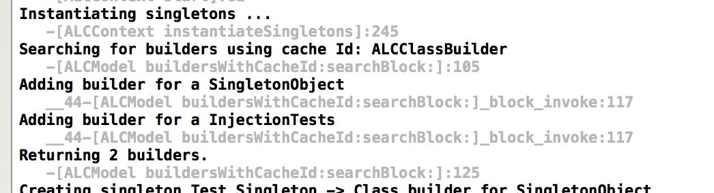

# WTF - Another Logging Framework!!! 

*Yes StoryTeller is a logging framework. But it's nothing like any logging framework you will have used before.*

Every other logging framework I've seen follows the same design - *Using a fixed set of message categories to control what gets logged.* A typically set being *debug, Warning, Info, Error* and *Fatal*. 

The idea behind this is that developers will sort their log statements out into the appropriate category when they add them to the code. When debugging, the developer then has to activate the levels required to log the details they need. Often having to search through large amounts of logging from  the entire app to find the information they require.

I created Story Teller because I never found a single logging framework that dared to question this basic design and it's inherant problem - *that it makes the developer choose when to log when they write the log statement.*    

Here's a example of how you might setup traditional logging (using a made up API):

```objc
// Set up logging
Logger *log = Logger sharedInstance];

// Activate logging
[log setLogLevel:LogLevel.Debug];

// ... 

logDebug(@"Current account number is %@", account.accNumber);
```

When debugging a problem with account 1223334433, you will first have to turn on logging of the debug category to print out every debug log statement across the entire app. Then you will have to read through a large amount of output, most of which will be irrelevant to debugging the account. 

__*Debugging with Story Teller is completely different*__. 

Story Teller throws out the concept of fixed logging categories, replacing them with a query driven logging system that selects log statements to output at run time. This lets you zero in on your problem precisely and results in a log that *only* contains the relevant information. 

Here's how Story Teller deals with debugging account 1223334444:

```objc
// Setup logging, actually nothing to setup

// Activate logging
STStartLogging(@"[account].accNumber == 1223334444");

// ...

STLog(account, @"Current account number is %@", account.accNumber);
```

Notice how we can specify a criteria for the log statements we want to see. Now the the entire log is relevant to the task at hand - ***How cool is that?***

# Installation

## Carthage

[Carthage](https://github.com/Carthage/Carthage) is the recommended method for including Story Teller in your projects. Simply create a  file called ***CartFile*** in the root of your project and add this line:

```
// Pulls the latest version.
github "drekka/StoryTeller"
```
Then open a command line and execute this command from the project's root directory:

```
carthage bootstrap
```

This will download and compile the following frameworks:

* __*&lt;project-root&gt;/Carthage/Build/iOS/StoryTeller.framework*__
* __*&lt;project-root&gt;/Carthage/Build/tvOS/StoryTeller.framework*__

Add the relevant framework as you would any other.

## Cocoapods

At the moment I don't support [Cocoapods](https://cocoapods.org) as I regard it as as hacky poor quality solution when compared with [Carthage](https://github.com/Carthage/Carthage). If you are familiar with Cocoapods, please feel free to create a pull request with an appropriate pod spec file.

# Adding Story Teller to your code

Story teller can be added using a module include (Yes this works in Objective-C):

```objc
@import StoryTeller;
```

# Logging

Story Teller has one basic logging statement:

```objc
STLog(<key>, <message-template>, <args ...>); 
```

`<key>` is an object that can be queried against when turning on logging. `<message-template>` and `<args...>` are exactly the same as you would use for `NSLog()` statements. 

## Story Teller keys

The core difference between Story Teller and all other logging frameworks is Story Teller's ability to use any object as a category for a logging statement. Story Teller uses the term *'key'* instead of category. The key for a statement can be anything you want - An account object, user object, a class, string, or any other valid Objective-C object. Whatever makes sense in your app. Here are some examples:

```objc
STLog(user, "User %@ is logging", user.id);
STLog(@(EnumValueGUI), "GUI is doing %@ with %@", aGUIValue, anotherGUIVaue);
STLog(currentView, "GUI is doing something with %@", currentView);
STLog(@"abc", @"ABC, ha ha ha ha ha");
```

## What if the keys not accessible?

Often you will have logging which does not have access to the object you want to use as a key. For example a method which performs currency conversion probably won't have the account object passed to it. 

*So how do you ensure that the conversion logging is also active when you are debugging an issue for the account?* 

Story Teller solves this problem with the concept of **Key Scopes**. You can tell it to make a key cover any number of log statements within a particular scope, even log statements within other classes and methods which don't have any access to the key. Here's an example:

```objc
-(void) firstMethod {
STStartScope(user);
[self doSomething];
}

// .. meanwhile down here
-(void) doSomething {
STLog(@"another key", "Lets log some other information"); 
}
```

When reporting based on user, the second log statement (key:account) will also be printed because it's within the scope of user.

Scopes follow these rules: 

* Key scopes follow normal Objective-C variable scopes. Under the hood Story Teller declares a variable at the scope declaration. When the variable's object deallocs, Story Teller ends the scope. Normally this is the end of the current method, loop or if statement. Assume a `STScopeStart(...)` is a variable declaration and you will ge the idea. 
* Any log statements found in calls to methods or functions, on the current class or another, are regarded as also having the scope's key. This enables then to log without having to pass the relevant key around.  

In the above example, the log statment in the `doSomething` method will also activate when the user is logging. Because `startScope(user)` is active when the method is called.

# Smart Logging Criteria

As you have seen in the first example above, you can use the `STStartLogging(&lt;criteria&gt;)` statment to activate a log. But what is this criteria? 

## General logs

First up there are two special logs you can activate:

```objectivec
STStartLogging(@"LogAll");
STStartLogging(@"LogRoots");
```

***LogAll*** activates all log statements and disregards any other logging criteira. This is literally a turn everything on option so don't expect to use it often and it's not really what Story Teller is about.

***LogRoots*** is similar to *LogAll* except that it only logs when there are not scopes active. The idea is to get a log showing the highlevel activity in the system. So how well it works depends on how well you setup you log statements. LogRoots will also be overridden by LogAll if it is turned on.


## Simple value criteria

When Story Teller encounters a single value in a criteria, it makes the assumption that the same value has been used as a key. Simple values can be either strings or numbers. Using strings mades a good descriptive sense, whilst integers can be a good idea for matching enums. Notice that with strings, if you don't have any white space in the value, you can enter it without quotes. 

For example:

```objectivec
STLog("abc", @"Log some abc stuff");
STLog("GUI System", @"Log view @ %@", aRect);
STLog(@(EnumValueX), @"Log related to EnumValueX");
```

```objectivec
STStartLogging(@"abc");
STStartLogging(@"\"GUI System\"");
STStartLogging(@(EnumValueX)); 
```

## Classes or Protocol criteria 

You can log based on the type of the key used like this:

`[class-name] | <protocol-name>`

These will search for any logging where the key is an instance of the class (or is a subclass of it), or an instance that implements the specified protocol. Here's an example:

```objectivec
STLog(User, @"Log message for a user");
```

```objectivec
STStartLogging(@"[User]");
STStartLogging(@"<Person>");    /* Assuming User implements Person */
```

## KVC Property criteria

`[class-name].keypath op value`
`<protocol-name>.keypath op value`

This criteria looks for keys that matches the specified class or protocol, then examine the `keypath` on the object for the required value. Here are some examples

```objectivec
STStartLogging(@"[User].account.name == \"derek's account\"");
STStartLogging(@"[User].account.balance > 500");
STStartLogging(@"<Banking>.active == YES");
STStartLogging(@"<Banking>.lastLogon == nil");
STStartLogging(@"<Banking>.customer != <Banker>");
```
As you can see there is a lot of power here to decide what gets logged. Values fall into several types:

* **Strings** - any string. Quotes are required if it incudes whitespace.
* **Numbers** - Any number, integer or decimal format. Number queries can use all the standard comparison operators: **==** ,**!=** ,**<** ,**<=** ,**>** or **>=**.
* **nil checks** - 'nil' keyword which checks for nils exactly the same as Objective-C does. Nil checks  can only use the logical operators: **==** and **!=**.
* **type checks** - either a class or protocol declaration. The same way we declare the type of the key being searched.  Type checks can only use the logical operators: **==** and **!=**.

## Runtime criteria

Sometimes the best object o use for a key is a `Class` object. Or (rarely) you want to search on a property that returns a Class. In those cases you can use the **is** keyword to tell Story Teller to look for a Class rather than testing an object. 

For example:

```objectivec
STLog([User class], @"Log message for class");
```

Looking for Class or Protocol keys

```objectivec
STStartLogging(@"is [User]");
```

This difference here is that Story Teller looks for a Class object rather than an instance of the class.

Looking for Class values in properties

```objectivec
STStartLogging(@"[User].accountClass is [MerchantAccount]");
```

# Execution blocks

Story Teller has another trick up it's sleeve. Often we want to run a set of statements to assemble some data before logging or even to log a number of statements at once. With other frameworks we have to manually add some boiler plate around the statements to make sure they are not always being executed. Story Teller has a statement built specifically for this purpose:

```objectivec
STExecuteBlock(<key>, ^(id key) {
// Statements go here.
});
``` 

The block will only be executed if they currently active logging matches the key. This makes it a perfect way to handle larger and more complex logging situations.

# Release vs Debug

Story Teller is very much a Debug orientated logger. Is is not designed to be put into production apps. To that effect, it has a strip mode. Simply add this macro to your **Release** macro declarations and all Story Teller loggin will be stripped out, leaving your Release version a lean mean speed machine.

Disable macro name: **`DISABLE_STORY_TELLER`**

# Configuring logging

## On startup

Story Teller uses a set of options which it obtains via this process on startup:

1. A default setup is first created with no logging active.
2. Story Teller then searches all bundles in the app for a file called ***StoryTellerConfig.json***. If found this file is read and the base config is updated with any settings it contains.
3. Finally the process is checked and if any of the arguments set on the process match known keys in the config, then those values are updated.

The basic idea is that you can add a ***StoryTellerConfig.json*** file to your app to provide the general config you want to run with, and then during development you can override at will by setting arguments in XCode's scheme for your app.

Current the Json file has two settings and looks something like this:


```json
{
    "activeLogs": [
        "abc",                           /* A specific string key */
        12,                              /* A numeric (Enum?) key */
        "[User].account.balance > 500"   /* Any account over $500 */
    ],
    "loggerClass": "STConsoleLogger",  /* Optional */
    "logLineTemplate": "{{file}}:{{line}} {{message}}" /* Optional */
}
```


### Template keys

Key  | Value
------------- | -------------
activeLogs | A comma separated list of keys to activate. This is the main setting for turning on logging.
loggerClass | If you want to set a different class for the, use this setting to specify the class. The class must implement `<STLogger>` and have a no-arg constructor. You only need to put the class name in this setting. Story Teller will handle the rest. By default, Story Teller uses a simple console logger.
logLineTemplate | The template of each line in the log. See [XcodeColors & Logging Templates](#xcodecolors-&-logging-templates) below for details of this value.

## Environment variables

You can also pass the settings via enviroment variables. For example, you could set them up in an Xcode schema for running the app.

**loggerClass** and **logLineTemplate** are settable. To activate a log you use one or more **log** settings. 

## Programmatically

You can also programmically enable and disable logging as well. To enable logging, use this statement:

```objectivec
STStartLogging(<key>);
```

## XCodeColors & Logging templates

[XCodeColors](https://github.com/robbiehanson/XcodeColors) is an excellant tool for colour coding your XCode console output. Story Teller supports using it to colour code the details and message of the output. In addition, you can also fully customise the layout of the log lines. 

### [XCodeColors](https://github.com/robbiehanson/XcodeColors)

If you have XcodeColors installed you can use the following setup to configure Story Tellers console logger. This *Only* works for the `STConsoleLogger`.

```objectivec
((STConsoleLogger *)[STStoryTeller storyTeller].logger).addXcodeColours = YES;

// Only need these if you want to change from the default colours. Which are these colours !
((STConsoleLogger *)[STStoryTeller storyTeller].logger).messageColour = [UIColor blackColor];
((STConsoleLogger *)[STStoryTeller storyTeller].logger).detailsColour = [UIColor lightGrayColor];
```

### Customising the logging template.

The default template for a logged line looks like this:


`{{time}} {{function}}:{{line}} {{message}}`


As you can see it's based on typical [Moustache templating](https://mustache.github.io) using curly brackets and keywords to define where to insert various pieces of information. Naturally you can customize this. Here's how:

```objectivec
[STStoryTeller storyTeller].logger.lineTemplate = [NSString stringWithFormat:@"%1$@\n   %2$@:%3$@", STLoggerTemplateKeyMessage, STLoggerTemplateKeyFunction, STLoggerTemplateKeyLine];
``` 

All the above example does is build a new template string using some predefined strings. This is recommended as it's less likely to trigger mistakes. The only required keyword in any template is the `STLoggerTemplateKeyMessage` (`{{message}}`). All others are optional. Here's an example of the output from the above setup:




#### Template keywords

Built in variable  | Text value | Inserts a ...
------------- | ------------- | ------------- 
STLoggerTemplateKeyMessage | &#123;&#123;message&#125;&#125; | ***(Required)*** The finished message argument from `STLog(...)` with all arguments inseted. 
STLoggerTemplateKeyFile | &#123;&#123;file&#125;&#125; | the name of the source code file.
STLoggerTemplateKeyFunction | &#123;&#123;function&#125;&#125; | A string representation of the method name which generated the log message.
STLoggerTemplateKeyLine | &#123;&#123;line&#125;&#125; | The line number of the `STLog(...)` command.
STLoggerTemplateKeyThreadId | &#123;&#123;threadId&#125;&#125; | The current thread id.
STLoggerTemplateKeyThreadName | &#123;&#123;threadName&#125;&#125; | he current thread's name.
STLoggerTemplateKeyTime | &#123;&#123;time&#125;&#125; | The current time.
STLoggerTemplateKeyTime | &#123;&#123;key&#125;&#125; | The Story Teller *key* associated with the `STLog(...)` command.


# Async

The only time async logging is needed is when logging a massive amount of information to a file. In 30 years of developing I've never seen an instance where a log like this has been of any use. 

In addition developers will invaraibly turn off async logging because the delay between an event occuring and the logged statements appearing in the log can be too long and cause the developer to be given a false impression of where the code is at. 

Story Teller is built for debugging. Not producing files or winning speed tests. So it does not support async logging.

# Performance

Performance is something that is a factor when logging because logging to the console or a file is inheriantly slow. Other frameworks follow the basic design concept of - *That we want to log everything and sort it out later.* This is very wasteful. Especially in the mobile world where dumping everything into a file just on the off chance that someone might want to look at it is quite out of the question. 

Because Story Teller uses smarter logging techniques, it will often be faster than traditional logging frameworks simply because it produces less output, more than compensating for the extra processing required.

## Update - some bench marks

I decided to get an idea of how Story Teller actually compared. So I created a test project and put both Story Teller and a *Very Popular 3rd party logging framework* into it. 

I configured the project to log 1,000 lines of text to the console and store the duration of the process. I also made sure that each line of text was different. I then added further processing to do this loop  10 times and average the durations. 

I then ran this with the other framework set to 'Debug', and Story Teller configured with a criteria similar to `'[Dummy].forbar = YES'` with the log key being an instance of class Dummy. Finally I turned off async logging on the other framework as no developer works with it on and Story Teller does not support it. The idea was to make sure that I was comparing oranges with oranges.

The results where suprising. In a straight time run of logging Story Teller was actually **4x faster** than the competitor. This totally surprised me and the only thing I could think of was that the competitor must have a lot of compexity in it that I simply haven't added to Story Teller. But still - ***4x?***

I then ran the tests again. This time with all logging turned off. The idea being to see how the embedded code impacted performance of the main code. This time the competitor easily out performed Story Teller. This was expected as the competitor was designed around very fast boolean switches and could optimize out the logging statements. Story Teller on the other hand, has to leave everything in places because the logging decisions are made at runtime and therefore cannot be avoided, even if no logging is actually done. 

Still, Story Teller ran the same loop of avg(1,000)x10 very fast. In the region of 0.001 sec per 1,000 log statements (testing the decision making). When logging, it was around 0.1 sec. So even with it's significantly more intelligent logging, it's no slouch.

# Credits

* Thanks to Todd Ditchendorf for [PEGKit](https://github.com/itod/pegkit). I've learned a lot from working with it.
* Big Thanks to the guys behind [Carthage](https://github.com/Carthage/Carthage) for writing a dependency tool that actual works well with XCode and Git.
* Thanks to Mulle Cybernetik for [OCMock](ocmock.org). An outstanding mocking framework for Objective-C that has enabled me to test the un-testable many times.


